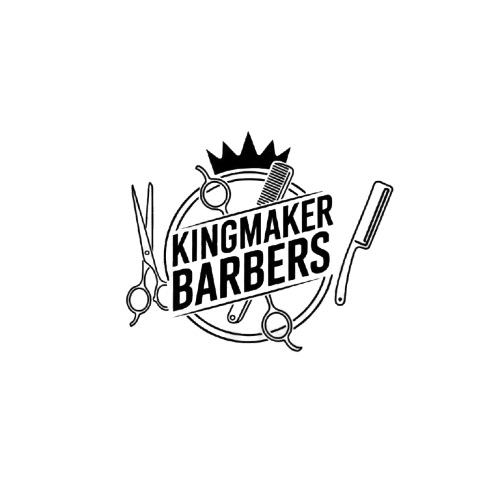

# 👑 KingMaker Barbers

<div align="center">
  
  
  ### Plataforma Profesional de Gestión de Barbería
  
  
  
  
  
  
  [Demo](#-demo) • [Características](#-características) • [Instalación](#-instalación) • [Uso](#-uso) • [Documentación](#-documentación)
</div>

---

## 📖 Descripción

**KingMaker Barbers** es una solución web completa y moderna para la gestión integral de servicios de barbería. La plataforma permite a los clientes reservar citas, comprar productos premium, dejar valoraciones y gestionar su perfil, mientras que los administradores cuentan con un panel de control completo para la gestión del negocio.

### 🎯 Objetivos del Proyecto

- Digitalizar y modernizar la gestión de barberías
- Ofrecer una experiencia de usuario premium y profesional
- Facilitar la reserva de citas online 24/7
- Integrar un sistema de e-commerce para productos de barbería
- Proporcionar herramientas de gestión para administradores

---

## ✨ Características

### 👥 Para Clientes

- **🔐 Autenticación Segura**
  - Registro e inicio de sesión con validación
  - Protección CSRF en todos los formularios
  - Gestión de sesiones seguras

- **📅 Sistema de Reservas**
  - Reserva de citas con selección de profesional
  - Visualización de disponibilidad en tiempo real
  - Historial de citas realizadas

- **🛒 Tienda Online**
  - Catálogo de productos premium
  - Carrito de compras interactivo
  - Proceso de pago simplificado
  - Múltiples métodos de pago (tarjeta, PayPal, efectivo)
  - Facturación automática por email

- **⭐ Sistema de Valoraciones**
  - Reseñas por profesional
  - Calificación de 1 a 5 estrellas
  - Comentarios y feedback

- **👤 Gestión de Perfil**
  - Edición de datos personales
  - Historial de compras
  - Gestión de reservas activas

### 🛠️ Para Administradores

- **📊 Panel de Control**
  - Dashboard con estadísticas en tiempo real
  - Gráficos de rendimiento
  - KPIs principales

- **👨‍💼 Gestión de Usuarios**
  - CRUD completo de usuarios
  - Búsqueda y filtrado avanzado
  - Asignación de roles
  - Paginación inteligente

- **📦 Gestión de Productos**
  - Añadir, editar y eliminar productos
  - Control de stock
  - Gestión de imágenes
  - Categorización

- **📅 Gestión de Reservas**
  - Visualización de citas programadas
  - Confirmación y cancelación
  - Asignación de profesionales

- **💬 Gestión de Valoraciones**
  - Moderación de reseñas
  - Respuesta a comentarios
  - Estadísticas de satisfacción

### 🎨 Diseño y UX

- **Responsive Design:** Adaptado a todos los dispositivos (móvil, tablet, desktop)
- **Modo Oscuro:** Diseño elegante con temática oscura profesional
- **Animaciones Suaves:** Transiciones y efectos visuales modernos
- **Búsqueda Inteligente:** Filtrado en tiempo real
- **Navegación Intuitiva:** Menú sticky con efectos hover
- **Feedback Visual:** Notificaciones y alertas informativas

---

## 🚀 Tecnologías

<table>
  <tr>
    <td align="center" width="200">
      
      <br><strong>Laravel 10</strong>
      <br><sub>Framework PHP</sub>
    </td>
    <td align="center" width="200">
      
      <br><strong>Blade</strong>
      <br><sub>Motor de plantillas</sub>
    </td>
    <td align="center" width="200">
      
      <br><strong>Tailwind CSS</strong>
      <br><sub>Framework CSS</sub>
    </td>
  </tr>
  <tr>
    <td align="center" width="200">
      
      <br><strong>MySQL</strong>
      <br><sub>Base de datos</sub>
    </td>
    <td align="center" width="200">
      
      <br><strong>EmailJS</strong>
      <br><sub>Envío de emails</sub>
    </td>
    <td align="center" width="200">
      
      <br><strong>JavaScript</strong>
      <br><sub>Interactividad</sub>
    </td>
  </tr>
</table>

---

## 📋 Requisitos Previos

Antes de comenzar, asegúrate de tener instalado:

- **PHP >= 8.1**
- **Composer >= 2.0**
- **Node.js >= 18.x** y **NPM >= 9.x**
- **MySQL >= 8.0** o **MariaDB >= 10.3**
- **Git**

---

## 🔧 Instalación

### 1️⃣ Clonar el Repositorio

```bash
git clone https://github.com/tu-usuario/kingmaker-barbers.git
cd kingmaker-barbers
```

### 2️⃣ Instalar Dependencias

```bash
# Dependencias de PHP
composer install

# Dependencias de Node.js
npm install
```

### 3️⃣ Configurar Variables de Entorno

```bash
# Copiar el archivo de ejemplo
cp .env.example .env

# Generar clave de aplicación
php artisan key:generate
```

Edita el archivo `.env` con tus credenciales:

```env
APP_NAME="KingMaker Barbers"
APP_ENV=local
APP_DEBUG=true
APP_URL=http://localhost:8000

DB_CONNECTION=mysql
DB_HOST=127.0.0.1
DB_PORT=3306
DB_DATABASE=kingmaker_barbers
DB_USERNAME=tu_usuario
DB_PASSWORD=tu_contraseña

MAIL_MAILER=smtp
MAIL_HOST=smtp.mailtrap.io
MAIL_PORT=2525
MAIL_USERNAME=tu_username
MAIL_PASSWORD=tu_password
```

### 4️⃣ Crear Base de Datos

```sql
CREATE DATABASE kingmaker_barbers CHARACTER SET utf8mb4 COLLATE utf8mb4_unicode_ci;
```

### 5️⃣ Ejecutar Migraciones y Seeders

```bash
# Ejecutar migraciones
php artisan migrate

# Ejecutar seeders (datos de prueba)
php artisan db:seed
```

### 6️⃣ Compilar Assets

```bash
# Desarrollo
npm run dev

# Producción
npm run build
```

### 7️⃣ Crear Storage Link

```bash
php artisan storage:link
```

### 8️⃣ Iniciar Servidor

```bash
php artisan serve
```

La aplicación estará disponible en: **http://localhost:8000**

---

## 👤 Credenciales de Prueba

### Administrador
- **Email:** admin@kingmaker.com
- **Password:** admin123

### Cliente
- **Email:** cliente@example.com
- **Password:** cliente123

---

## 📂 Estructura del Proyecto

```
kingmaker-barbers/
├── app/
│   ├── Http/
│   │   ├── Controllers/      # Controladores
│   │   └── Middleware/       # Middleware personalizado
│   ├── Models/               # Modelos Eloquent
│   └── Providers/            # Service Providers
├── database/
│   ├── migrations/           # Migraciones de BD
│   ├── seeders/              # Seeders de datos
│   └── factories/            # Factories para testing
├── public/
│   ├── css/                  # Estilos compilados
│   ├── js/                   # Scripts compilados
│   └── images/               # Imágenes y assets
├── resources/
│   ├── views/                # Plantillas Blade
│   │   ├── layouts/          # Layouts principales
│   │   ├── admin/            # Vistas de admin
│   │   └── components/       # Componentes reutilizables
│   └── css/                  # Archivos CSS fuente
├── routes/
│   ├── web.php               # Rutas web
│   └── api.php               # Rutas API (futuro)
├── config/                   # Archivos de configuración
├── storage/                  # Archivos generados
└── tests/                    # Tests automatizados
```

---

## 🎨 Paleta de Colores

```css
/* Colores principales */
--gold: #D4AF37;           /* Dorado principal */
--dark: #0A0A0A;           /* Negro profundo */
--dark-gray: #1A1A1A;      /* Gris oscuro */
--medium-gray: #2D2D2D;    /* Gris medio */

/* Tipografías */
--font-heading: 'Rye', cursive;     /* Títulos */
--font-body: 'Poppins', sans-serif; /* Cuerpo */
```

---

## 🔒 Seguridad

- ✅ Protección CSRF en todos los formularios
- ✅ Validación de entrada en servidor
- ✅ Passwords hasheados con bcrypt
- ✅ Middleware de autenticación
- ✅ Protección contra SQL Injection (Eloquent ORM)
- ✅ Sanitización de datos
- ✅ Headers de seguridad configurados

---

## 🧪 Testing

```bash
# Ejecutar todos los tests
php artisan test

# Ejecutar tests con cobertura
php artisan test --coverage

# Ejecutar tests específicos
php artisan test --filter NombreDelTest
```

---

## 🚀 Deployment

### Producción con Apache/Nginx

1. Configurar el servidor web apuntando a `/public`
2. Establecer permisos correctos:

```bash
chmod -R 755 storage bootstrap/cache
chown -R www-data:www-data storage bootstrap/cache
```

3. Optimizar aplicación:

```bash
php artisan config:cache
php artisan route:cache
php artisan view:cache
composer install --optimize-autoloader --no-dev
```

### Variables de Entorno en Producción

```env
APP_ENV=production
APP_DEBUG=false
APP_URL=https://tu-dominio.com
```

---

## 📚 Documentación Adicional

### Rutas Principales

| Ruta | Descripción | Auth |
|------|-------------|------|
| `/` | Página de inicio | No |
| `/login` | Inicio de sesión | No |
| `/register` | Registro | No |
| `/productos` | Catálogo de productos | No |
| `/reservas` | Sistema de reservas | Sí |
| `/carrito` | Carrito de compras | Sí |
| `/perfil` | Perfil de usuario | Sí |
| `/valoraciones` | Reseñas | No |
| `/admin/panel` | Panel administrativo | Admin |

### Comandos Artisan Personalizados

```bash
# Limpiar caché completo
php artisan optimize:clear

# Generar datos de prueba
php artisan db:seed --class=TestDataSeeder

# Backup de base de datos
php artisan backup:run
```

---

## 🤝 Contribuir

Las contribuciones son bienvenidas. Para cambios importantes:

1. Fork el proyecto
2. Crea tu rama de característica (`git checkout -b feature/AmazingFeature`)
3. Commit tus cambios (`git commit -m 'Add some AmazingFeature'`)
4. Push a la rama (`git push origin feature/AmazingFeature`)
5. Abre un Pull Request

### Guía de Estilo

- Seguir PSR-12 para PHP
- Usar convenciones de Laravel
- Comentar código complejo
- Escribir tests para nuevas funcionalidades

---

## 🐛 Reportar Bugs

Si encuentras un bug, por favor abre un [issue](https://github.com/tu-usuario/kingmaker-barbers/issues) con:

- Descripción del problema
- Pasos para reproducirlo
- Comportamiento esperado vs actual
- Screenshots (si aplica)
- Entorno (SO, versión de PHP, etc.)

---

## 📝 Roadmap

- [ ] App móvil (React Native)
- [ ] Sistema de notificaciones push
- [ ] Integración con Google Calendar
- [ ] Chat en tiempo real
- [ ] Sistema de fidelización/puntos
- [ ] API REST completa
- [ ] Panel de analíticas avanzado
- [ ] Multi-idioma (i18n)
- [ ] Integración con pasarelas de pago

---

## 📄 Licencia

Este proyecto está bajo la Licencia MIT. Ver el archivo [LICENSE](LICENSE) para más detalles.

```
MIT License

Copyright (c) 2024 KingMaker Barbers

Permission is hereby granted, free of charge, to any person obtaining a copy
of this software and associated documentation files (the "Software"), to deal
in the Software without restriction...
```

---

## 👨‍💻 Autor

**Mariano Dominguez Bermúdez**

- GitHub: [@tu-usuario](https://github.com/Mdb713o)
- Email: mariandominguez456@gmail.com

---

## 🙏 Agradecimientos

- [Laravel](https://laravel.com) - Framework PHP
- [Tailwind CSS](https://tailwindcss.com) - Framework CSS
- [Font Awesome](https://fontawesome.com) - Iconos
- [EmailJS](https://www.emailjs.com) - Servicio de email
- [Unsplash](https://unsplash.com) - Imágenes

---

## 📞 Soporte

¿Necesitas ayuda? Contáctanos:

- 📧 Email: marianodominguez456@gmail.com

---

<div align="center">
  
  ### ⭐ Si este proyecto te fue útil, considera darle una estrella
  
  **Hecho con ❤️ por [Mariano Domínguez Bermúdez]**
  
  
  
</div>
